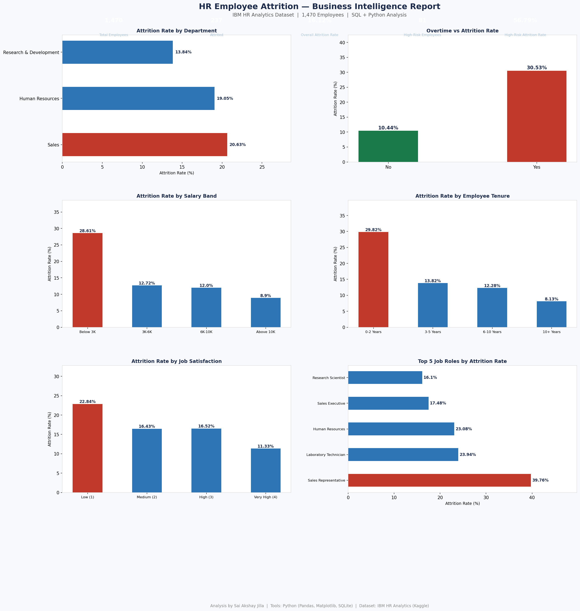

# HR Employee Attrition Analysis
### SQL + Python | IBM HR Analytics Dataset | 1,470 Employees

---

## Project Overview

Employee attrition is a critical business problem that directly impacts organizational productivity and hiring costs. This project analyzes the IBM HR Analytics dataset to identify the key drivers of employee attrition using SQL queries and Python-based visualization, delivering actionable insights for HR decision-making.

---

## Dataset

- **Source:** [IBM HR Analytics Employee Attrition Dataset — Kaggle](https://www.kaggle.com/datasets/pavansubhasht/ibm-hr-analytics-attrition-dataset)
- **Size:** 1,470 employee records
- **Features:** 35 attributes including department, job role, salary, tenure, overtime, job satisfaction, and more

---

## Tools & Technologies

| Tool | Purpose |
|---|---|
| Python | Data loading, analysis, visualization |
| Pandas | Data manipulation and aggregation |
| SQLite (in-memory) | SQL query execution on tabular data |
| Matplotlib | Chart generation and report layout |
| Jupyter Notebook | Development environment |

---

## Business Questions Answered

1. What is the overall attrition rate across the organization?
2. Which departments have the highest attrition?
3. How does overtime impact employee attrition?
4. Does salary band influence likelihood of leaving?
5. Are newer employees more likely to leave than tenured ones?
6. How does job satisfaction correlate with attrition?
7. Which job roles are highest risk?
8. What does the high-risk employee segment look like?

---

## Key SQL Queries Used

- `CASE WHEN` statements for attrition rate calculation
- `GROUP BY` with aggregation for department and role analysis
- Salary banding using `CASE WHEN` ranges
- Tenure segmentation with `BETWEEN` conditions
- High-risk segment filtering with multiple `WHERE` conditions

---

## Key Findings

| Insight | Finding |
|---|---|
| Overall Attrition Rate | 16.12% |
| Highest Attrition Department | Sales (20.63%) |
| Overtime Employees Attrition | 30.53% vs 10.44% (non-overtime) |
| Highest Risk Salary Band | Below $3K/month |
| Highest Risk Tenure | 0–2 years (31.25%) |
| High-Risk Segment Attrition | 56.79% (Age < 30, Overtime, Income < $5K) |

---

## Business Recommendations

**1. Address Overtime Policy**
Employees working overtime churn at nearly 3x the rate. Review workload distribution and introduce compensatory policies for high-overtime roles.

**2. Focus Retention on Early Tenure**
Employees in their first 2 years show 31%+ attrition. Structured onboarding programs and early career development plans can reduce this significantly.

**3. Salary Review for Lower Bands**
The below-$3K salary band shows the highest attrition. Benchmarking compensation against market rates for entry and junior roles is critical.

**4. Sales Department Intervention**
Sales has the highest departmental attrition at 20.63%. Targeted retention programs, clearer career progression, and incentive restructuring are recommended.

---

## Output



---

## Project Structure

```
hr-employee-attrition-analysis/
│
├── project1_hr_sql.py          # Main analysis script
├── HR_Attrition_Analysis.png   # Output visualization
├── WA_Fn-UseC_-HR-Employee-Attrition.csv  # Dataset
```

---

## Author

**Sai Akshay Jilla**
- LinkedIn: [linkedin.com/in/saiakshay-jilla](https://linkedin.com/in/saiakshay-jilla)
- GitHub: [github.com/saiakshay-24](https://github.com/saiakshay-24)
